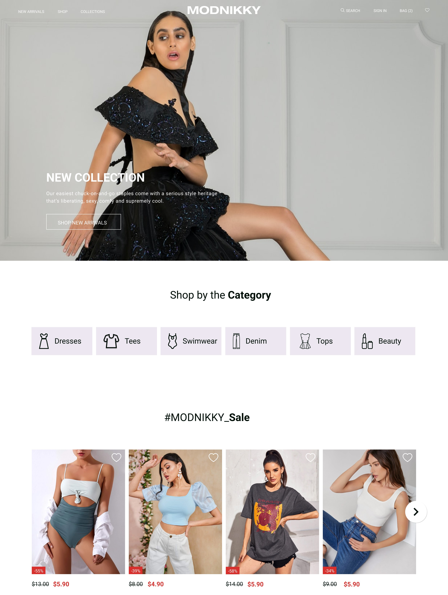
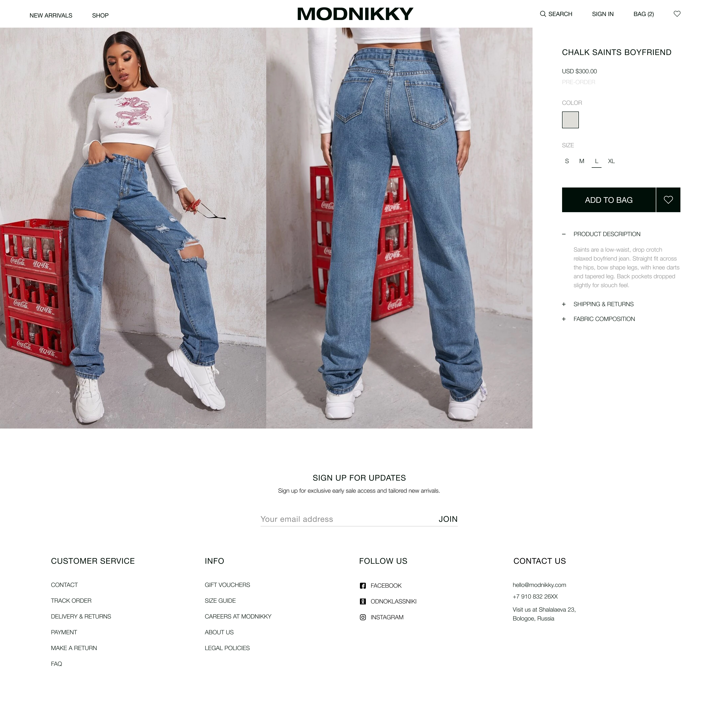
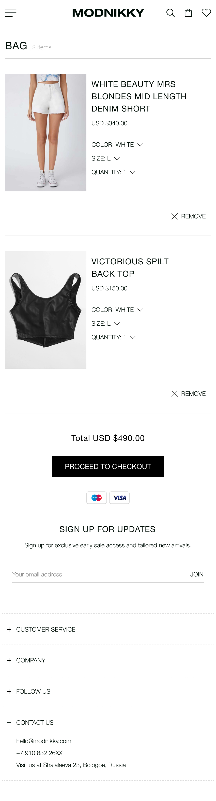

# Modnikky online store

## Overview

My first SPA on Vue.js as an introduction to this JavaScript framework. Modnikky is an online store of women clothes with PLP, PDP, bag, wish-list and authentication pages. This project created using a build setup based on [Vite](https://vuejs.org/guide/quick-start.html) that allowed me to use Vue Single-File Components. As a state manager I used [Pinia](https://pinia.vuejs.org/) because of proper TypeScript support. Also I used [Vue-lazyload](https://github.com/hilongjw/vue-lazyload) for lazyloading images in my application and [Swiper](https://github.com/nolimits4web/Swiper) for implementation of most modern mobile touch slider with hardware accelerated transitions and amazing native behavior to my application. I performed the authorization myself using localStorage Web API and Cookie.

> Home page and product page in desktop view, and bag page in mobile view

  

_[ORIGINAL DESIGN](<https://www.figma.com/file/EU9rX288YZxT6RcpMmMOcO/Diplom-projects_Front-end-(1)?node-id=1%3A1386>)_

## Requirments

- Flexible and correct layout according to the design;
- Authentication on Client-side;
- Filtering by category and searching by name and description for products on the page;
- Ability to change the number of products in the bag and add products from wish-list to the bag;
- Subscribe to news by email.

## Project Setup

```sh
npm install
```

### Compile and Hot-Reload for Development

```sh
npm run dev
```

### Type-Check, Compile and Minify for Production

```sh
npm run build
```

## Summary

I tried to build a good application architecture, but in the end I ran into a few points that I hadn't fully thought through as logic processing - is there more logic in the components, in the store, or is it taken out separately in utilities? In the end I used a mixture of Options and Composition API to get familiar with the two approaches. Next I would prefer to use Composition API because better logic reuse, more flexible code organization, better type inference, smaller production bundle and less overhead.
